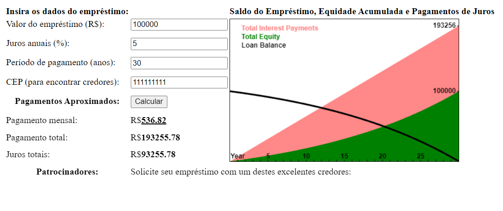

# Calculadora de Empréstimos

**Aplicação de Leitura de Imagens** é uma aplicação web desenvolvida como parte de um projeto de aprendizado, replicando os exemplos apresentados no livro "JavaScript: The Good Parts". O objetivo é reforçar conceitos de desenvolvimento web utilizando HTML, CSS e JavaScript ao criar uma ferramenta prática de cálculo de empréstimos.

## Estrutura

O projeto está estruturado nos seguintes arquivos principais:

- **src/index.html**: Contém a estrutura HTML da aplicação, incluindo o formulário de entrada para os dados do empréstimo e a tabela de resultados.
- **src/style.css**: Define o estilo da aplicação, formatando a saída e adicionando uma borda ao gráfico.
- **src/script.js**: Implementa a lógica da calculadora, manipulando os valores inseridos pelo usuário, exibindo os resultados e desenhando o gráfico de amortização no elemento <canvas>.

## Tecnologias Utilizadas

O projeto foi desenvolvido utilizando as seguintes tecnologias:

- **HTML5**: Para estruturar a interface da aplicação.
- **CSS3**: Para o design e estilo.
- **JavaScript**: Para a lógica de cálculo dos valores de empréstimo e interação com o DOM.
- **Canvas API**: Para desenhar gráficos visualizando os pagamentos e amortizações do empréstimo.

## Pré-requisitos

Para rodar a aplicação localmente, você precisará de um navegador moderno que suporte JavaScript, HTML5 e a API <canvas>. Não há necessidade de instalar dependências adicionais.

## Rodando Localmente

Para executar o projeto localmente, siga estas etapas:

1. Clone o repositório para sua máquina local:

   ```bash
   git clone https://github.com/hiago19/appCalculadoraEmprestimo.git
   ```
2. Navegue até o diretório do projeto:

   ```bash
   cd appCalculadoraEmprestimo
   ```

3. Abra o arquivo index.html em seu navegador.

## Funcionalidades

- **Cálculo de Pagamento Mensal**: Calcula o valor do pagamento mensal com base no valor do empréstimo, taxa de juros anual e período de pagamento (em meses ou anos).
- **Cálculo do Pagamento Total**: Exibe o valor total que será pago durante todo o período do empréstimo, somando o principal e os juros.
- **Cálculo dos Juros Totais**: Calcula e exibe o valor total pago em juros ao longo do período do empréstimo.
- **Gráfico de Amortização**: Desenha um gráfico de amortização utilizando a API <canvas>, que ilustra visualmente como o saldo devedor, os juros pagos e a equidade (capital próprio) mudam ao longo do tempo.
- **Armazenamento Local**: Salva os dados do formulário (como valor do empréstimo, taxa de juros e duração) no navegador, para que possam ser recuperados automaticamente em visitas futuras, facilitando o uso contínuo.

## Demonstração

Aqui está uma capturas de tela do projeto em execução:

1. **appCalculadoraEmprestimo**:
   